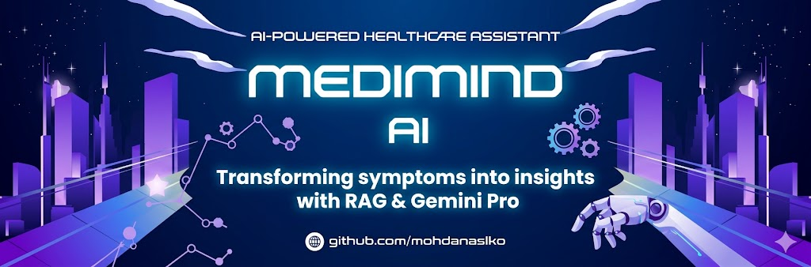

  

# 🏥 MediMindAI: RAG-Powered Healthcare Assistant

MediMindAI is an advanced healthcare solution that uses **Retrieval-Augmented Generation (RAG)** to provide intelligent disease prediction and medical insights. By combining **Google Gemini Pro** with **LangChain**, it ensures responses are grounded in verified medical datasets.

## 🌟 Key Features
- **RAG Implementation:** Uses LangChain to query a custom medical vector database for accurate symptom-to-disease mapping.
- **Multi-Modal Analysis:** Capable of analyzing medical reports and asking intelligent follow-up questions.
- **LLM Integration:** Powered by Google Gemini API for natural, context-aware conversations.
- **Vector Search:** Efficient document retrieval using ChromaDB.

## 🛠️ Tech Stack
- **AI/ML:** Python, LangChain, Google Gemini Pro API
- **Web Framework:** FastAPI
- **Data:** RAG-based Vector Store
- **Frontend:** HTML5, CSS3, JavaScript

## 🚀 Deployment Guide
To run this locally:
1. Clone the repo: `git clone https://github.com/mohdanaslko/MediMindAI.git`
2. Install dependencies: `pip install -r requirements.txt`
3. Set up your `.env` file with your `GEMINI_API_KEY`.
4. Run the app: `python -m uvicorn app:app --reload`

---
*Disclaimer: This tool is for educational purposes and is not a substitute for professional medical diagnosis.*
## 🚀 Live Demo
You can try the live version of MediMindAI here: 

